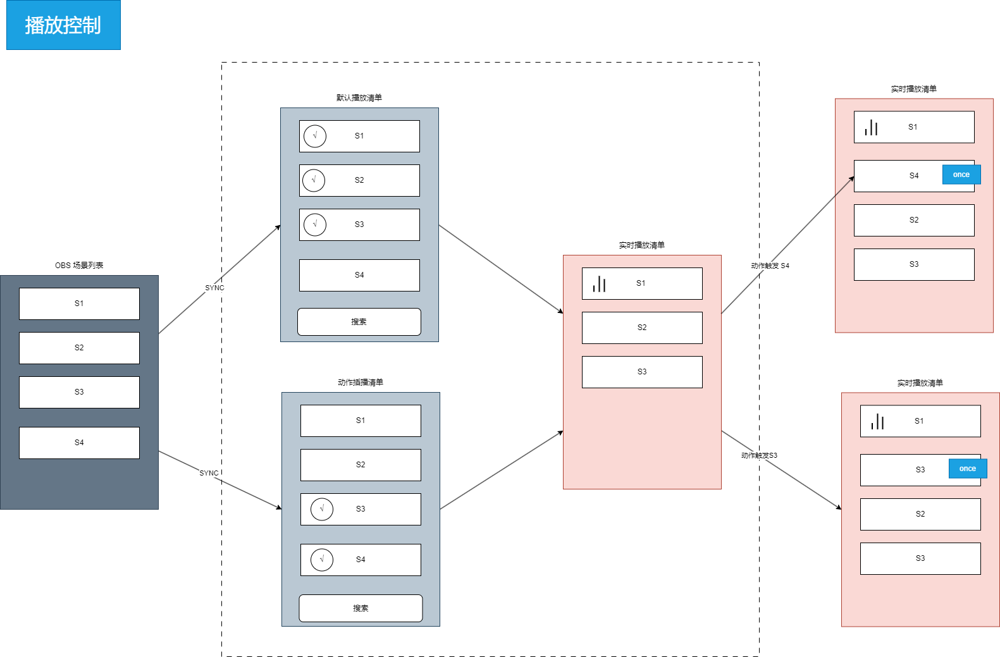

# 拓扑图

## 客户端

- 激活, 绑定/解绑
- Electron
    - 主控页面做到服务端在线网页
    - 获取直播间实时评论做到客户端本地
        - 支持多家直播平台 如 TikTok/抖音/快手/Bilibili/等等
        - 评论捕获方案以页面脚本注入方式为主快速实现和扩展多平台, 后台实现(落地较慢的)方案为终极方式 
        - 按所选直播平台动态选择加载注入脚本, 从服务器加载, 非 electron preload js.
    - 直播间页面
        - 方案1: 用子窗口打开, 最多存在一个
        - 方案2: 用WebContentsView打开, 与主页面共存于mainWindow
        - 方案3: 方案1+方案2, 可配并可动态切换
- 多国语 i18n
    - 中文
    - 英文
- 主题
    - 白天
    - 夜晚
    - 跟随系统
- OBS配置
    - 地址
    - 端口
    - 密码
- OBS双向同步
    - 场景
    - 直播(推流)状态
- 自启
    - 开机自启
    - 意外关闭自动恢复现场
- 通知
    - 通知场景: 系统负载报警, 捕获评论异常, OBS推流异常, 等等
    - 通知方式: 短信, 邮件, 微信,...

## 无人场景

- 默认播放节目(对应OBS场景)清单
    - 每个节目都需配置播放时长
- 动作触发播放节目清单
    - 每个节目都需配置播放时长
- 默认转场场景
    - 入场: 关闭 或 选择一个场景, 优先级最低, 需配置播放时长
    - 出场: 关闭 或 选择一个场景, 优先级最低, 需配置播放时长
- 指定转场场景: 
    - 指定节目入场: 关闭 或 选择一个场景, 优先级高于默认, 需配置播放时长
    - 指定节目出场: 关闭 或 选择一个场景, 优先级高于默认, 需配置播放时长
- 动作触发策略:
    - 用户评论完全匹配xx关键字
    - 用户评论包含xx关键字
    - 用户送xx礼物
    - 前xx个用户
    - 同一个节目触发间隔时间
    - ...

    

## 服务端